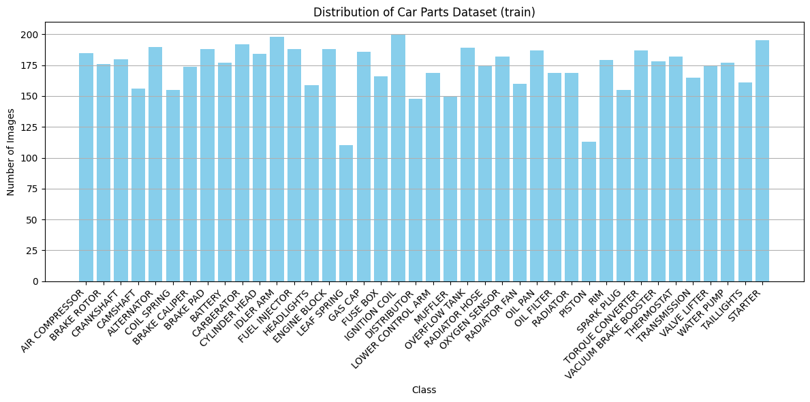
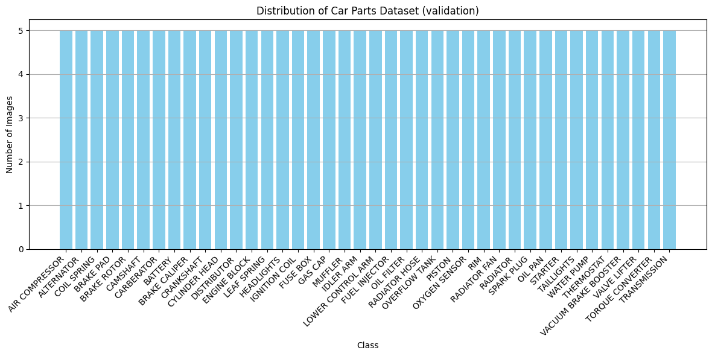
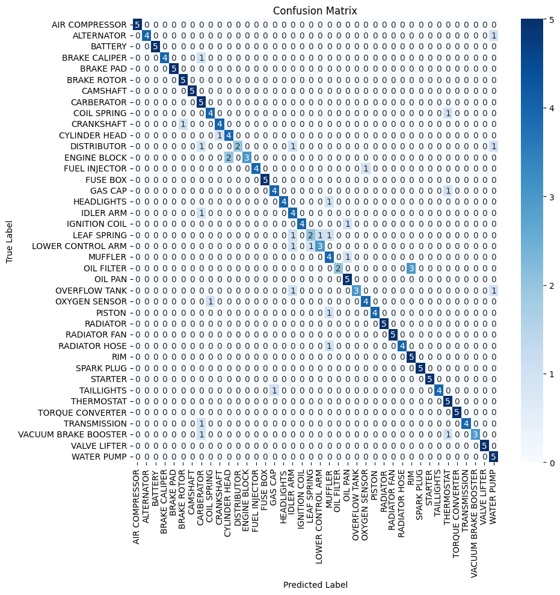
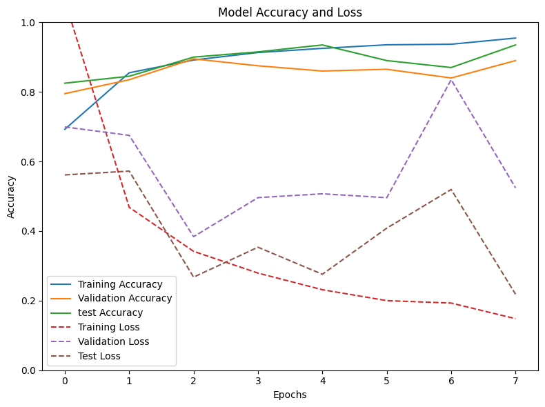
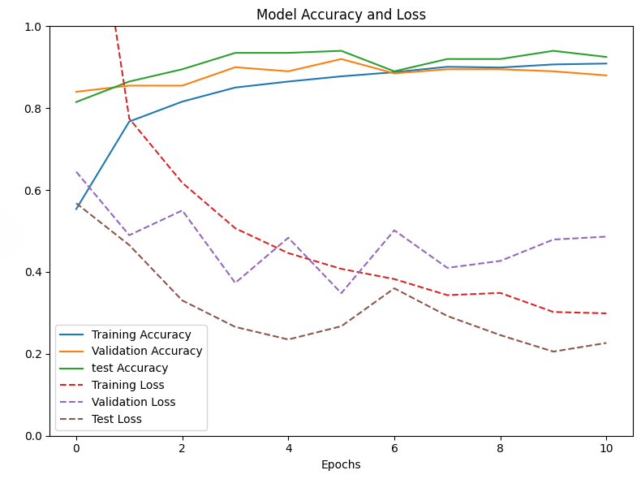
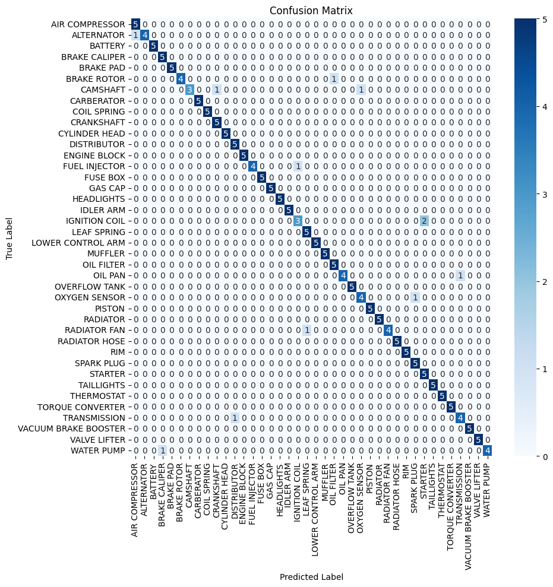

# Carssification AI: A Machine Learning Model for Image Classification of Car Parts

**Alan Patricio González Bernal**  
**A01067546**

## Abstract
This project presents a detailed evaluation of a deep learning model for the
classification of car parts into 40 distinct classes using a Convolutional Neural
Network (CNN) based on the ResNet50 architecture. The model employs transfer
learning by leveraging pretrained weights from ResNet50[[3](https://doi.org/10.3390/bioengineering9030097)]
, which enhances its performance in distinguishing between multiple classes of car parts.

The model is constructed with several layers, enabling multiclass classification.
 Training is conducted using categorical crossentropy
as the loss function and the Adam optimizer, with early stopping and model
checkpointing implemented to prevent overfitting and ensure optimal performance.

Evaluation metrics, including precision, recall, and F1-score, are computed
from the confusion matrix to assess model performance. The results indicate
that the model achieves a validation accuracy of up to <b>90.5%</b>, with a precision
of <b>94.7%</b>, a recall of <b>94%</b>, and an F1-score of <b>93.8%</b>. This comprehensive
approach demonstrates the effectiveness of deep learning in automating the
classification of car parts, thereby facilitating enhanced workflows in
automotive industries.

<b>Keywords</b>: image classification, ResNet50, car parts, convolutional neural
network, transfer learning, car

## Introduction
The increasing number of vehicles, associated with the introduction of Chinese
vehicles in our country comes with a series of benefits and downsides, one of the
downsides is the increasing number of car parts being damaged, due to accidents or
errors in the dealerships. This problem impacts many lines of service, including
dealerships and work shops. In order to detect which parts are damaged, first is
necessary to be able to detect these parts automatically[[1](https://doi.org/10.1155/2023/6460639)] To contribute to this 
challenge, this project will focus on developing an image classification model 
capable of recognizing and categorizing vehicle parts from images.

This project employs a deep learning approach, specifically using a Convolutional 
Neural Network (CNN) based on the ResNet50 architecture. CNNs are particularly 
well-suited for image classification tasks due to their ability to automatically 
learn and extract features from images, making them highly effective for tasks involving 
visual data. The ResNet50 architecture, with its deep residual learning framework, 
allows for the training of very deep networks while addressing the vanishing gradient
problem, which is a common issue in deep learning[[7](https://www.cv-foundation.org/openaccess/content_cvpr_2016/papers/He_Deep_Residual_Learning_CVPR_2016_paper.pdf)].

The model used model is based on the ResNet50 architecture, one of the most widely used models
for image classification tasks, along with transfer learning techniques to improve
the model's performance. Transfer learning allows the model to leverage
pretrained weights from a model trained on a large dataset, such as ImageNet, to
enhance its ability to classify images of car parts. This approach is particularly
effective when the dataset is limited, as it allows the model to learn from
features learned from a larger dataset, thereby improving its accuracy and
generalization capabilities[[3](https://doi.org/10.3390/bioengineering9030097)].

## Material and Methods
### Dataset 
The dataset used in this study was sourced from Kaggle, the car-parts dataset[[8](https://www.kaggle.com/datasets/gpiosenka/car-parts-40-classes)].
This dataset is structured in folders representing different classes, facilitating its 
use in machine learning models.

The dataset followed the next structure:
```
- train
- test
- valid
- car parts.csv
```
and the labels are as follows:
| 1-10  | 11-20 | 21-30 | 31-40  |
|--------------------|-------------------|------------------|---------------------|
| AIR COMPRESSOR     | CYLINDER HEAD     | LOWER CONTROL ARM| RIM                 |
| ALTERNATOR         | DISTRIBUTOR       | MUFFLER          | SPARK PLUG          |
| BATTERY            | ENGINE BLOCK      | OIL FILTER       | STARTER             |
| BRAKE CALIPER      | FUEL IJNECTOR     | OIL PAN          | TAILLIGHTS          |
| BRAKE PAD          | FUSE BOX          | OVERFLOW TANK    | THERMOSTAT          |
| BRAKE ROTOR        | GAS CAP           | OXYGEN SENSOR    | TORQUE CONVERTER    |
| CAMSHAFT           | HEADLIGHTS        | PISTON           | TRANSMISSION        |
| CARBERATOR         | IDLER ARM         | RADIATOR         | VACUUM BRAKE BOOSTER|
| COIL SPRING        | IGNITION COIL     | RADIATOR FAN     | VALVE LIFTER        |
| CRANKSHAFT         | LEAF SPRING       | RADIATOR HOSE    | WATER PUMP          |


## Methodology
### Preprocessing
The dataset is distributed as follows:
<p align="center">
  
</p>
<p align="center"><em>Figure 1. Dataset Distribution (Train)</em></p>

each instance is from a fixed size (254x254 pixles) and they are already
separated in folders by class, so to preprocess the data, the `ImageDataGenerator` class from Keras was used.
This class allows for easy loading and preprocessing of images, including
data augmentation techniques to improve the model's generalization capabilities.

The definition of the batch size which is set to 16[[7](https://www.cv-foundation.org/openaccess/content_cvpr_2016/papers/He_Deep_Residual_Learning_CVPR_2016_paper.pdf)] and to
define a class mode which is set to `categorical` since the model
is a multiclass classification model.

The validation and test sets are also already separated as follows:

<p align="center">
  
  
</p>
<p align="center">
  <em>Figure 2. Dataset Distribution (Validation) &nbsp;&nbsp;&nbsp; Figure 3. Dataset Distribution (Test)</em>
</p>

However since the validation and Test data are not as substantial as the training 
data, Data Augmentation was applied to both validation and Test sets to increase 
the number of instances and improve the model's generalization capabilities. 
The augmentation techniques are:

| Technique | Value |
|------|------------|
| Rotation Range|   10   |
|width shift range |0.2 | 
| height shift range | 0.2 |
| horizontal flip |true |


Also as part of the preprocessing the `process_input` function from keras was
used, this is due to the normalization process required by ResNet50 which
requires
basically in inverting the RGB channels to BGR, and then subtracting the mean
pixel value from each channel[ [6](https://www.tensorflow.org/api_docs/python/tf/keras/applications/resnet/preprocess_input) ][[7](https://www.cv-foundation.org/openaccess/content_cvpr_2016/papers/He_Deep_Residual_Learning_CVPR_2016_paper.pdf)].

The batch size and number of epochs was selected as 16[[5](https://dergipark.org.tr/en/download/article-file/3202713?ref=https://git.chanpinqingbaoju.com)] and 25[[3](https://doi.org/10.3390/bioengineering9030097)] respectively, as it
is closer to the state of the art and it is a good balance between training time and
model performance.

Lastly, the class mode of the model is set to 'categorical' , since the model is a
multiclass classification model, this generates a one-hot encoded vector for each
class, allowing the model to output a probability distribution over the classes.

## Model
### Model selection
To tackle the problem of classifying car parts, a Convolutional Neural Network (CNN)
based on the ResNet50 architecture was selected as the state of the art has shown[[1](https://doi.org/10.1155/2023/6460639)][[2](https://doi.org/10.1007/s40747-021-00397-8)][[3](https://doi.org/10.3390/bioengineering9030097)][[4](https://openaccess.thecvf.com/content_CVPRW_2019/papers/MBCCV/Luo_Visual_Attention_in_Multi-Label_Image_Classification_CVPRW_2019_paper.pdf)][[5](https://dergipark.org.tr/en/download/article-file/3202713?ref=https://git.chanpinqingbaoju.com)]
that CNNs are highly effective for image classification tasks. Along with the ResNet50
architecture, transfer learning was employed to generate a model with increased accuracy
and generalization capabilities.

### evaluation metrics
In order to comply with the state of the art[[3](https://doi.org/10.3390/bioengineering9030097)][[4](https://openaccess.thecvf.com/content_CVPRW_2019/papers/MBCCV/Luo_Visual_Attention_in_Multi-Label_Image_Classification_CVPRW_2019_paper.pdf)][[5](https://dergipark.org.tr/en/download/article-file/3202713?ref=https://git.chanpinqingbaoju.com)], the metrics used to
evaluate the model are precision, recall, and F1-score. These metrics are
calculated using the confusion matrix, which is a table that summarizes the
performance of the classification model by comparing the predicted classes with the
actual classes.  

### Model Architecture
ResNet50 (Residual Network 50) is a deep convolutional
neural network that has been pretrained on the ImageNet dataset, which contains millions
of images across thousands of categories. The Residual Network architecture works by
introducing skip connections, allowing gradients to flow through the network more 
effectively during training. This helps to mitigate the vanishing gradient problem, 
enabling the training of very deep networks.

In the specific case of ResNet50, the model consists of 50 layers, including
convolutional layers, batch normalization layers, and fully connected layers. The
model is designed to learn hierarchical features from images, starting from low-level
features such as edges and textures, to high-level features such as shapes and objects.
The model is trained using a large dataset of labeled images, allowing it to learn
the patterns and characteristics of different classes of images[[7](https://www.cv-foundation.org/openaccess/content_cvpr_2016/papers/He_Deep_Residual_Learning_CVPR_2016_paper.pdf)].

The ResNet50 model has been frozen, meaning that the weights of the model
are not updated during training. This is done to leverage the pretrained weights
from the ImageNet dataset, allowing the model to benefit from the features learned
from the ImageNet dataset.

Along with the ResNet50 model, the custom model architecture is a sequential model
that has the next hyperparameters:

| Name | Parameters |
|------|------------|
| ResNet50|   PreTrained   |
|Global Average Pooling| 2D | 
| Dense | 512, ReLU activation |
| Dense |256, ReLU activation |
| Dense |128, ReLU activation |
| Dense |40, Softmax activation |

This architecture consists of a ResNet50 model as the base allowing the transfer
learning to take advantage of the pretrained weights, followed by a global average pooling
layer to reduce the spatial dimensions of the feature maps, and then three fully connected
layers with ReLU activation functions to learn complex features from the images.
Finally, a dense layer with 40 units and a softmax activation function is used to
output the probabilities for each of the 40 classes of car parts.

The model is trained using categorical crossentropy as the loss function and the Adam
optimizer, with early stopping marked at the fifth non-improvement epoch and model 
checkpointing implemented to prevent overfitting and ensure optimal performance. 

## Execution
### Training and first evaluation
The model was trained using the training set and got the next metrics:
```
- Precision
    - 89.4%
- Recall
    - 87.5%
- F1-score
    - 87.2%
```
This metrics where calculated using the confusion matrix, which is presented on figure 4.
<p align="center">
  
</p>
<p align="center"><em>Figure 4. Confusion Matrix. First evaluation</em></p>


This metrics and the Figure 5 indicate that there's room for improvement as overfitting
(high training accuracy and low validation accuracy) is present. Also the
loss values indicate the model is not converging, as the training loss is 
significantly lower than the validation loss. It's important to note that even
though it was set to run for 25 epochs, it stopped on the 7th due to the 
early stopping which indicates the model reached a point where there was
no improvement anymore. 

<p align="center">
  
</p>
<p align="center">
  <em>Figure 5. Model accuracy and Loss. First evaluation</em>
</p>

This data allows us to conclude that, even though the model is able to
classify car parts with a good degree of accuracy, the loss values indicate 
that the model is not converging and the validation accuracy is significantly
lower than the training accuracy, which indicates that the model is overfitting 
to the training data.

### Model refinement

After the first evaluation, the model was refined by adding dropout layers to
the architecture to prevent overfitting and improve the model's generalization capabilities.
The refined model architecture is as follows:

| Name | Parameters |
|------|------------|
| ResNet50|     |
| Dropout | 0.3 |
|Global Average Pooling|  | 
| Dense | 512, ReLU activation |
| Dropout | 0.3 |
| Dense |256, ReLU activation |
| Dense |128, ReLU activation |
Dropout | 0.2 |
| Dense |40, Softmax activation |

This specific architecture introduces dropout layers after the ResNet50 model and
after each dense layer, with dropout rates of 0.3, 0.3, and 0.2 respectively.
This helps to reduce overfitting by randomly setting a fraction of the input units to 0
during training, which forces the model to learn more robust features and prevents it
from relying too heavily on any specific feature.

### Retraining and final evaluation

After the refinement of the model, the model was retrained using the same
training set and the same parameters. The model achieved the next metrics:

```
- Precision
    - 94.7%
- Recall
    - 94.0%
- F1-score
    - 93.8%
```

If we see the Figure 6, we can see that
the model is not overfitting and the validation accuracy is close to the training
accuracy, which indicates that the model is generalizing well to unseen data.

It's important to note that even though the model had 25 epochs, the early stopping
was triggered at the 10th epoch which indicates that the model reached a point
where it was not improving anymore, thus preventing overfitting and saving training time (and
resources).

<p align="center">
  
</p>
<p align="center"><em>Figure 6. Model Accuracy and loss</em></p>

The model was also evaluated using a confusion matrix, which shows the
number of correct and incorrect predictions for each class. The confusion matrix
is shown in Figure 7. The figure shows that the model is able to
classify most of the classes correctly, with some classes having a higher
number of misclassifications than others. The diagonal values represent the
number of correct predictions for each class, while the off-diagonal values
represent the number of misclassifications.
<p align="center">
  
</p>
<p align="center"><em>Figure 7. Confusion Matrix</em></p>

This results indicate that the diagnosis of the model was correct and the
model is capable of classifying car parts with a high degree of accuracy.

## Conclusion
In conclusion, the project successfully developed a deep learning model for classifying 
car parts into 40 distinct classes using a Convolutional Neural Network (CNN) based on the 
ResNet50 architecture, employing transfer learning techniques to enhance its performance.

While good results were achieved, there is room for improvement. Future work could involve 
refining the model architecture, experimenting with different hyperparameters, and exploring 
additional data augmentation techniques to enhance generalization. Testing the model on a larger 
and more diverse dataset would also be beneficial for evaluating its performance in real-world scenarios.

Additionally, the model could be integrated into a broader system for automating car part 
classification, facilitating workflows in the automotive industry. Implementing it on mobile 
devices or web applications would allow users to classify parts in real-time, improving 
efficiency and reducing repair times.

## Executing the model
In this repository, you can find the Jupyter Notebook used to train the model and
evaluate it. The notebook is structured to allow you to run the model on your own machine,
and it includes all the necessary steps to preprocess the data, train the model, and evaluate its performance.

Also the model is saved in the `model` folder, so you can load it and use it to classify car parts.
It's important to note that it's needed to first unzip the model in order to use it.


## References
[1] A. Aldawsari, S. A. Yusuf, R. Souissi, and M. AL-Qurishi, "Real-Time Instance Segmentation Models for Identification of Vehicle Parts," Research Article, Elm Company, Riyadh, Saudi Arabia, Apr. 11, 2023. [Online]. Available: https://doi.org/10.1155/2023/6460639

[2] K. Pasupa, P. Kittiworapanya, N. Hongngern, and K. Woraratpanya, "Evaluation of deep learning algorithms for semantic segmentation of car parts," Complex & Intelligent Systems, vol. 8, pp. 3613–3625, May 2021. [Online]. Available: https://doi.org/10.1007/s40747-021-00397-8

[3] S. Bechelli and J. Delhommelle, "Machine learning and deep learning algorithms for skin cancer classification from dermoscopic images," Bioengineering, vol. 9, no. 3, p. 97, Feb. 2022. [Online]. Available: https://doi.org/10.3390/bioengineering9030097

[4] Y. Luo, M. Jiang, and Q. Zhao, "Visual Attention in Multi-Label Image Classification," in Proceedings of the IEEE/CVF Conference on Computer Vision and Pattern Recognition Workshops (CVPRW), 2019, [Online]. Available: https://openaccess.thecvf.com/content_CVPRW_2019/papers/MBCCV/Luo_Visual_Attention_in_Multi-Label_Image_Classification_CVPRW_2019_paper.pdf

[5] M. Pektaş, "Performance Analysis of Efficient Deep Learning Models for Multi-Label Classification of Fundus Image," Artificial Intelligence Theory and Applications, vol. [Online]. Available: https://dergipark.org.tr/en/download/article-file/3202713?ref=https://git.chanpinqingbaoju.com

[6] TensorFlow, "tf.keras.applications.resnet.preprocess_input," [Online]. Available: https://www.tensorflow.org/api_docs/python/tf/keras/applications/resnet/preprocess_input

[7] K. He, X. Zhang, S. Ren, and J. Sun, "Deep Residual Learning for Image Recognition," in Proceedings of the IEEE Conference on Computer Vision and Pattern Recognition (CVPR), Las Vegas, NV, USA, Jun. 2016. [Online]. Available: https://www.cv-foundation.org/openaccess/content_cvpr_2016/papers/He_Deep_Residual_Learning_CVPR_2016_paper.pdf

[8] Gpiosenka, "Car Parts 40 Classes," Kaggle, 2021. [Online]. Available: https://www.kaggle.com/datasets/gpiosenka/car-parts-40-classes.
